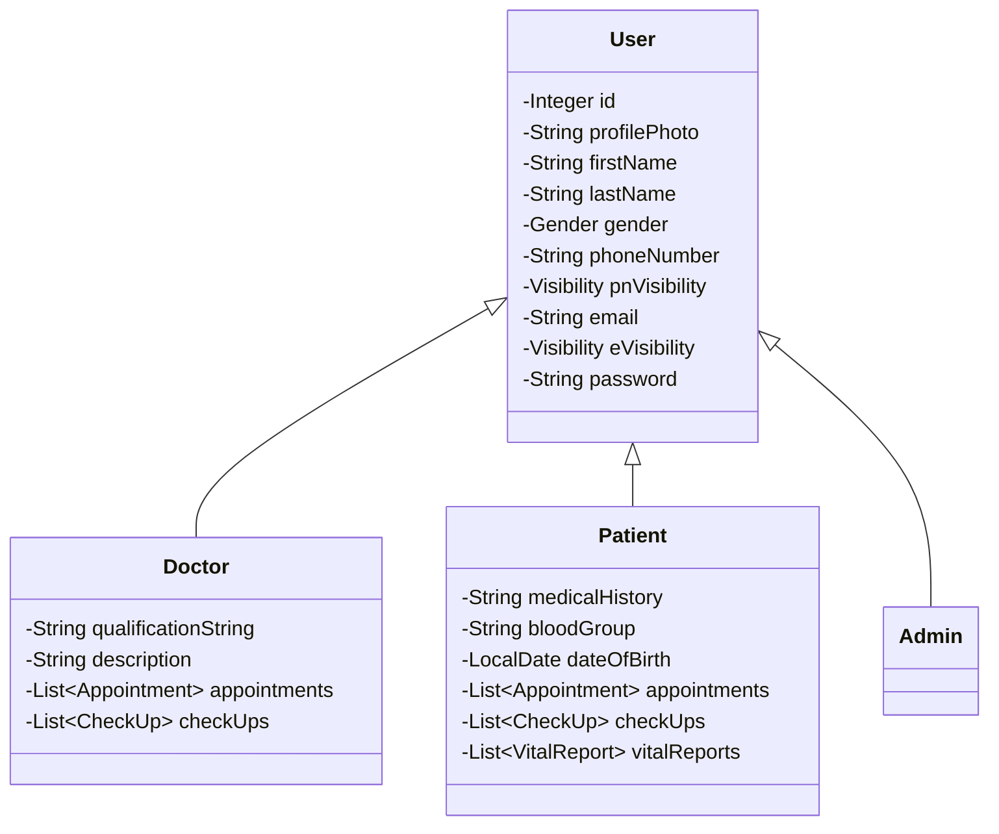
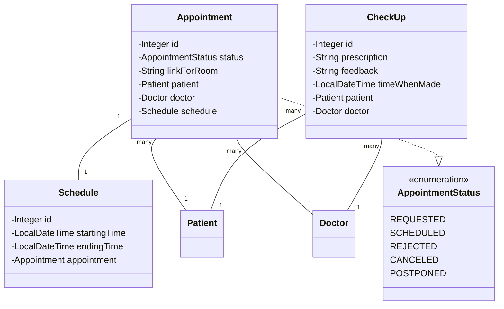
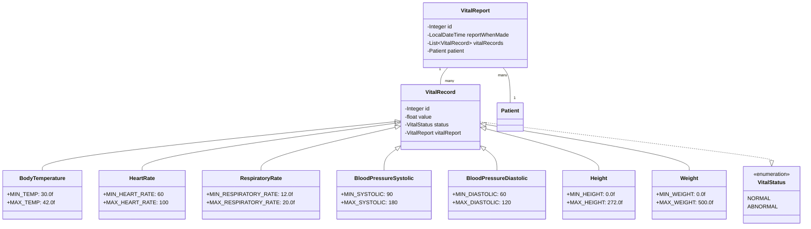
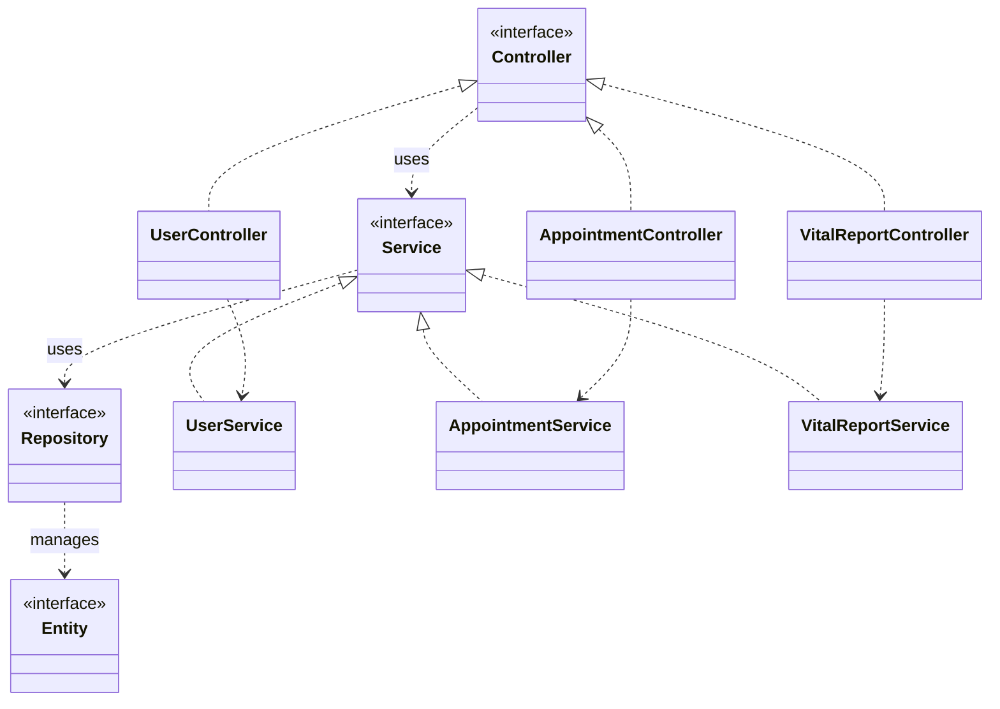
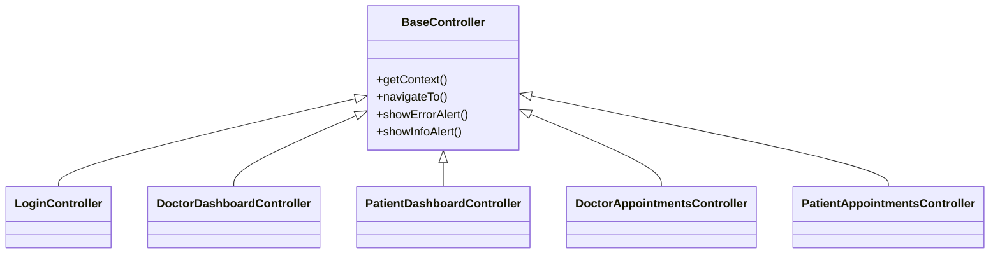
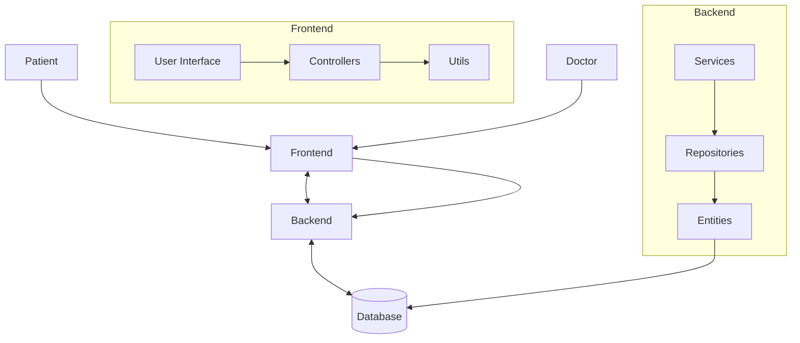

# Remote Vitals System - Class Structure

This document provides an overview of the main classes in the Remote Vitals System and their relationships.

## User Management

## Appointments and Scheduling

## Vital Records System

## System Architecture

## Frontend Structure

## Data Flow

